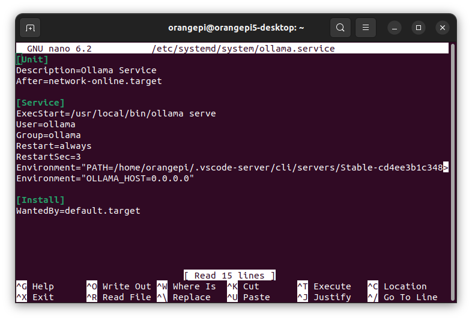
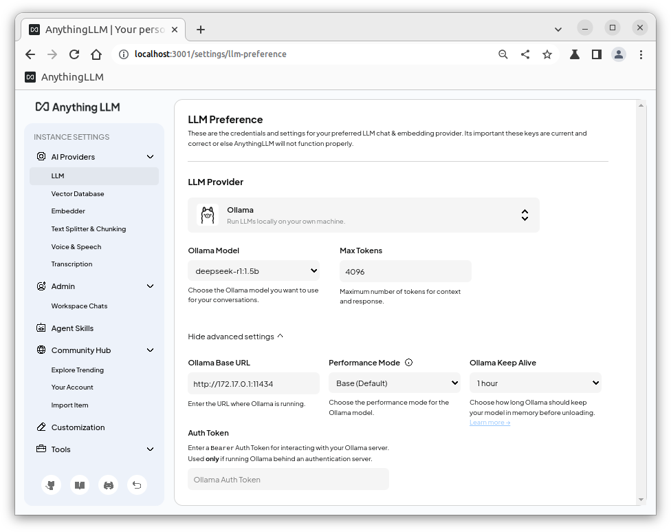
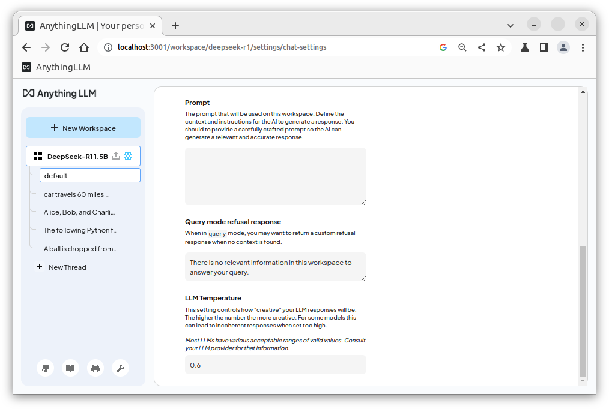
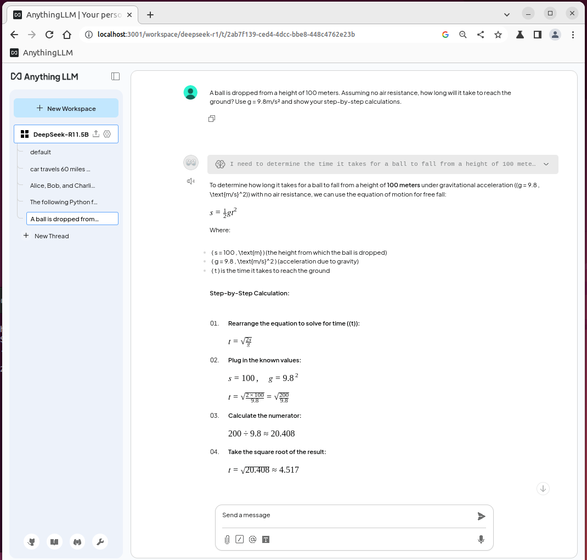

Installation of AnythingLLM for Ubuntu on ARM.

- [Introduction](#introduction)
- [Installation](#installation)
  - [1. Install Docker on Ubuntu](#1-install-docker-on-ubuntu)
  - [2. Install AnythingLLM docker](#2-install-anythingllm-docker)
  - [3. Setup Ollama for network access](#3-setup-ollama-for-network-access)
  - [4. Setup AnythingLLM for Ollama](#4-setup-anythingllm-for-ollama)
  - [5. Add AnythingLLM workspace settings for DeepSeek-R1](#5-add-anythingllm-workspace-settings-for-deepseek-r1)
- [Slow operation due to CPU contention](#slow-operation-due-to-cpu-contention)
- [Example chat](#example-chat)
- [Next Steps](#next-steps)

## Introduction

[AnythingLLM Desktop does not support ARM64 on Linux](https://github.com/Mintplex-Labs/anything-llm/issues/3383#issuecomment-2695014522).
Instead we must install AnythingLLM docker to run on ARM.  This docker
creates a web server for the AnythingLLM user interface.

This repo includes setup of Ollama for use with AnythingLLM.

Verified with DeepSeek-R1 1.5B LLM on an
[OrangePi 5 single board computer with 8GB RAM](http://www.orangepi.org/html/hardWare/computerAndMicrocontrollers/details/Orange-Pi-5.html)
runing Ubuntu 22.04 Desktop.

> Note I am a beginner user of docker so this may be verbose.

## Installation

### 1. Install Docker on Ubuntu

I read these links for this section.
* https://docs.docker.com/engine/install/ubuntu/
* https://docs.docker.com/engine/install/ubuntu/#install-using-the-repository
* https://docs.docker.com/engine/install/linux-postinstall/

Uninstall old versions using Ubuntu Terminal.
```console
for pkg in docker.io docker-doc docker-compose docker-compose-v2 podman-docker containerd runc; do sudo apt-get remove $pkg; done
```

Add Docker's official GPG key.
```console
sudo apt-get update
sudo apt-get install ca-certificates curl
sudo install -m 0755 -d /etc/apt/keyrings
sudo curl -fsSL https://download.docker.com/linux/ubuntu/gpg -o /etc/apt/keyrings/docker.asc
sudo chmod a+r /etc/apt/keyrings/docker.asc
```

Add the repository to Apt sources.
```console
echo \
  "deb [arch=$(dpkg --print-architecture) signed-by=/etc/apt/keyrings/docker.asc] https://download.docker.com/linux/ubuntu \
  $(. /etc/os-release && echo "${UBUNTU_CODENAME:-$VERSION_CODENAME}") stable" | \
  sudo tee /etc/apt/sources.list.d/docker.list > /dev/null
```

Install docker.
```console
sudo apt-get update
sudo apt-get install docker-ce docker-ce-cli containerd.io docker-buildx-plugin docker-compose-plugin
```

Verify the docker install.  Expect `github.com/docker/buildx v0.21.1 7c2359c` or newer.
```console
docker buildx version
```

Fix permissions.
```console
sudo usermod -aG docker $USER
sudo systemctl restart docker
sudo chown $USER:$USER /var/run/docker.sock
```

Restart Terminal first, then test.
```console
docker run hello-world
```

This install can now run docker builds.  For example here is a Python test build
(optional step).
```console
git clone git@github.com:gaelgthomas/docker-first-application-example.git
cd docker-first-application-example/
docker build -t python-test .
docker run python-test
```

### 2. Install AnythingLLM docker

I read this link for this section.
* https://docs.anythingllm.com/installation-docker/local-docker

Install `yarn` and `node` in Ubuntu Terminal.
```console
sudo apt install yarn nodejs
```

Download the docker container for AnythingLLM.
```console
docker pull mintplexlabs/anythingllm
```

This command will mount and run the docker container.
```console
export STORAGE_LOCATION=$HOME/anythingllm && \
mkdir -p $STORAGE_LOCATION && \
touch "$STORAGE_LOCATION/.env" && \
docker run -d -p 3001:3001 \
--cap-add SYS_ADMIN \
-v ${STORAGE_LOCATION}:/app/server/storage \
-v ${STORAGE_LOCATION}/.env:/app/server/.env \
-e STORAGE_DIR="/app/server/storage" \
mintplexlabs/anythingllm
```
Using a web browser you can now use AnythingLLM at `http://localhost:3001`.
I tested with Chromium.

### 3. Setup Ollama for network access

I chose to use Ollama in AnythingLLM to test Steps 1 and 2.  After some testing
on Ubuntu I found it necessary to
[edit Ollama host IP](https://github.com/ernesttan1976/anythingllm-ollama/blob/main/server/utils/AiProviders/ollama/README.md#setting-environment-variables-on-linux)
for AnythingLLM docker to be able to communicate with Ollama.

Prerequisites.
* Install Ollama on Ubuntu, for example see [here](https://github.com/guynich/deepseek_opi5plus?tab=readme-ov-file#install-ollama).
* Pull an LLM for Ollama, for example `ollama pull deepseek-r1:1.5b`.

Check Ollama `serve` is running.
```console
ps aux | grep ollama
```
Expect a result like this.
```console
ollama      1006  0.0  0.3 1998084 26576 ?       Ssl  Mar13   0:04 /usr/local/bin/ollama serve
```

Test which model(s) are loaded in Ollama.  You should see the model that you pulled.
```console
curl http://localhost:11434/api/tags
```

We now need to
[edit Ollama host IP](https://github.com/ernesttan1976/anythingllm-ollama/blob/main/server/utils/AiProviders/ollama/README.md#setting-environment-variables-on-linux)
to have network access for AnythingLLM docker connection.  Run this command, or
use your favourite editor.
```console
sudo nano /etc/systemd/system/ollama.service
```
Add this one line under `[service]` section then save `ollama.service`.
```
Environment="OLLAMA_HOST=0.0.0.0"
```



After saving `ollama.service` reload Olama.
```console
systemctl daemon-reload
systemctl restart ollama
```

### 4. Setup AnythingLLM for Ollama

As explained in Step 3, I chose to use Ollama in AnythingLLM.  In this section
the final steps are made to start a chat session.

Using a web browser run AnythingLLM at `http://localhost:3001` - see Step 2.

In the AnythingLLM `Instance Settings` > `AI Providers` > `LLM` pane
* Set `LLM Provider` to `Ollama`.
* Set `Ollama Base URL` to `172.17.0.1:11434` (this is needed for Ubuntu OS).
* I selected `Ollama Model` to `deepseek-r1:1.5b` as pulled earlier.
* During testing I set keep alive to 1 hour.



Save these changes.

Stop the AnythingLLM docker container - or reboot Ubuntu.
```console
docker ps -a
docker stop <name>
```

### 5. Add AnythingLLM workspace settings for DeepSeek-R1

Additional workspace settings are recommended for this reasoning model.

First run the AnythingLLM docker.  This is needed after Step 4 and subsequent
reboots.
```console
export STORAGE_LOCATION=$HOME/anythingllm && \
mkdir -p $STORAGE_LOCATION && \
touch "$STORAGE_LOCATION/.env" && \
docker run -d -p 3001:3001 \
--cap-add SYS_ADMIN \
-v ${STORAGE_LOCATION}:/app/server/storage \
-v ${STORAGE_LOCATION}/.env:/app/server/.env \
-e STORAGE_DIR="/app/server/storage" \
mintplexlabs/anythingllm
```

Create a workspace in AnythingLLM docker.  I called my workspace
`DeepSeek-R1 1.5B`.

I then edited the **workspace** `Chat settings` according to these
[DeepSeek-R1 recommendations](https://github.com/deepseek-ai/DeepSeek-R1#usage-recommendations).
* Delete the default Prompt text and replace with a single whitespace.
* Set the LLM Temperature to `0.6`.



Save these changes.

You can now chat with DeepSeek-R1 in the AnythingLLM workspace!

## Slow operation due to CPU contention

In my testing of AnythingLLM docker and Ollama on the same instance I found the
DeepSeek-R1 1.5B model rate to be slow at <3 tokens/second.

This is more than 2x slower than running DeepSeek-R1 1.5B on Ollama using
command line or
[Python API](https://github.com/guynich/deepseek_opi5plus/tree/main/browser)
speeds of ~7 tokens/second.

I tried setting CPU affinities for Ollama to use the 4 fast cores of this
single board computer RK3588S SoC and AnythingLLM docker uses the 4 slow cores.
I found Ollama runs significantly slower without access to all 8 cores.

I tried setting CPU affinities for Ollama to use all 8 cores and AnythingLLM
docker to only use the 4 slow cores.  This did not mitigate slow operation.

I found running AnthingLLM Desktop on a MacBook and setting the Base URL to the
single board computer IP the LLM runs at the expected speed of ~7 tokens/second.

Root cause is CPU contention running both the LLM and AnythingLLM docker on the
single board computer (OrangePi 5 with 8GB RAM).  No known workaround.

## Example chat



## Next Steps

* [x] Debug slow model speed: AnythingLLM with Ollama/DeepSeek-R1 1.5B runs at <3 tokens/second on OrangePi 5 (RK3588S SoC).  This is slower than using Ollama on the command line (~7 tokens/second) on the same hardware.
* [ ] Add bash script to run AnythingLLM docker.
* [ ] Add instructions for starting the AnythingLLM docker on boot.
* [ ] Add instruction for updating AnythingLLM docker version.
* [ ] Simplify steps.
